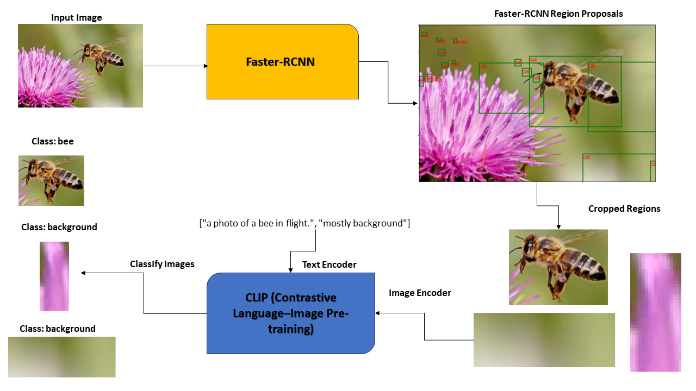
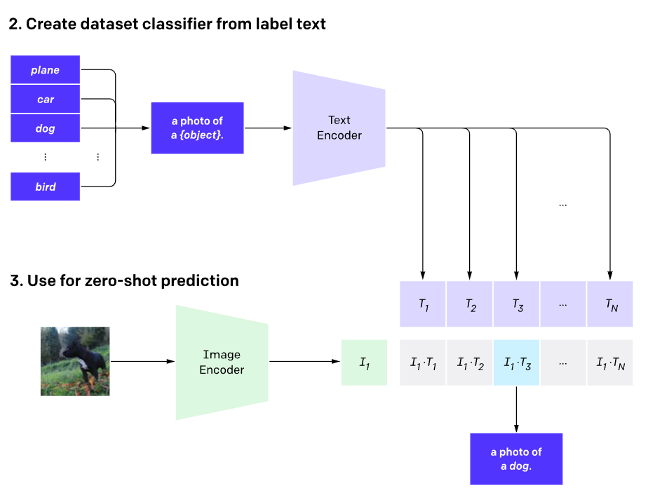

# Automated Data Labeling Using CLIP

## Introduction

Welcome to our repository, where we address a critical challenge in the field of image classification and object detection tasks: the scarcity of accurately labeled data. Our innovative pipeline is designed to automate the data labeling process by harnessing the power of OpenAI's CLIP model, offering a more efficient alternative to traditional methods.

## The Challenge

In projects involving image classification and object detection mechanisms like YOLO (You Only Look Once), obtaining accurately labeled data is often a significant bottleneck. Manually labeling datasets can be labor-intensive and time-consuming, impeding the development and accuracy of machine learning models.

## Solution

The pipeline tackles this challenge by automating the data labeling process, with the OpenAI CLIP model at its core. Known for its ability to understand and categorize images based on textual descriptions, CLIP enables us to correlate text and images effectively.

### CLIP

CLIP (Contrastive Language–Image Pre-training) is a neural network, which efficiently learns visual concepts from natural language supervision. CLIP is trained on a vast dataset of images and
corresponding textual descriptions. This training enables the model to learn the relationships between text and images, essentially understanding how specific visual elements in images correlate with the words and phrases used to describe them. By combining text and image CLIP has a broad generalization from the training data to a wide variety of real-world tasks, even those it wasn't explicitly trained on. CLIP can applied to visual classification by providing the names and visual categories to be recognized, similar to the `zero-shot` capabilities of `GPT-2` and `GPT-3`. 

**OpenAI CLIP Research Page:** [OpenAI CLIP Research](https://openai.com/research/clip)

## How It Works

The process starts with generating descriptive prompts for images in the dataset. These prompts are fed into CLIP, which categorizes the images accordingly. This not only accelerates labeling but also enhances label accuracy and diversity.

## Key Findings and Highlights

- **Faster R-CNN Integration:** Utilizing Faster R-CNN, our pipeline generated numerous region proposals, which were refined using CLIP.
- **Robust Detection:** CLIP's effectiveness in accurately classifying low-resolution images and complex scenes was noteworthy.
- **Efficiency:** This approach significantly reduces the time and automates effort required for data preparation, compared to manual labeling.

## End Goal

The goal is to streamline data preparation for image classification and object detection tasks, expediting the development of machine learning models with well-labeled, diverse datasets.

## Resources

To delve deeper into the CLIP model and its applications:

1. **OpenAI CLIP Research Page:** [OpenAI CLIP Research](https://openai.com/research/clip)
2. **CLIP GitHub Repository:** [CLIP on GitHub](https://github.com/openai/CLIP/tree/main)

## Explore and Contribute

I invite you to explore our repository, contribute, and leverage this pipeline for your image
classification and object detection projects.

